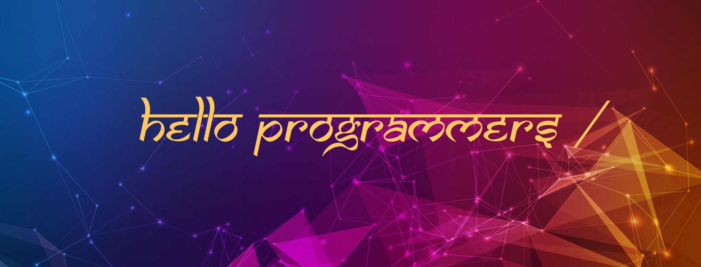

<h1 align="center">Hi,I'm Vikas</h1>
<h3 align="center">GET at Orange Business || MERN Development || UI Designer </h3>

  
 

- 🔭 I’m currently working on **MERN Application**,

- 📫 How to reach me: 📧 Vikas1000dhiman@gmial.com

- 💬 Ask me about **MERN** and **sql**

- ⚡ Fun fact **I love to play Volleyball** ,**I don't like slow pc**

### Connect with me:

<a href="https://www.facebook.com/profile.php?id=100014647546166" target="_blank">

 

 

  

 

### Languages and Tools:

 

  <strong>Github Stats: </strong>

 
  

  
  
 

